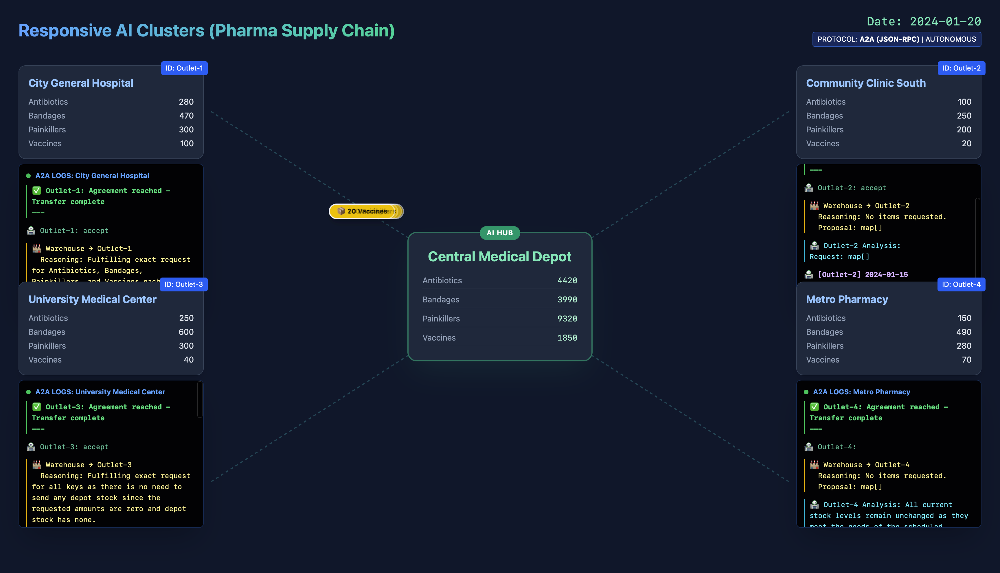
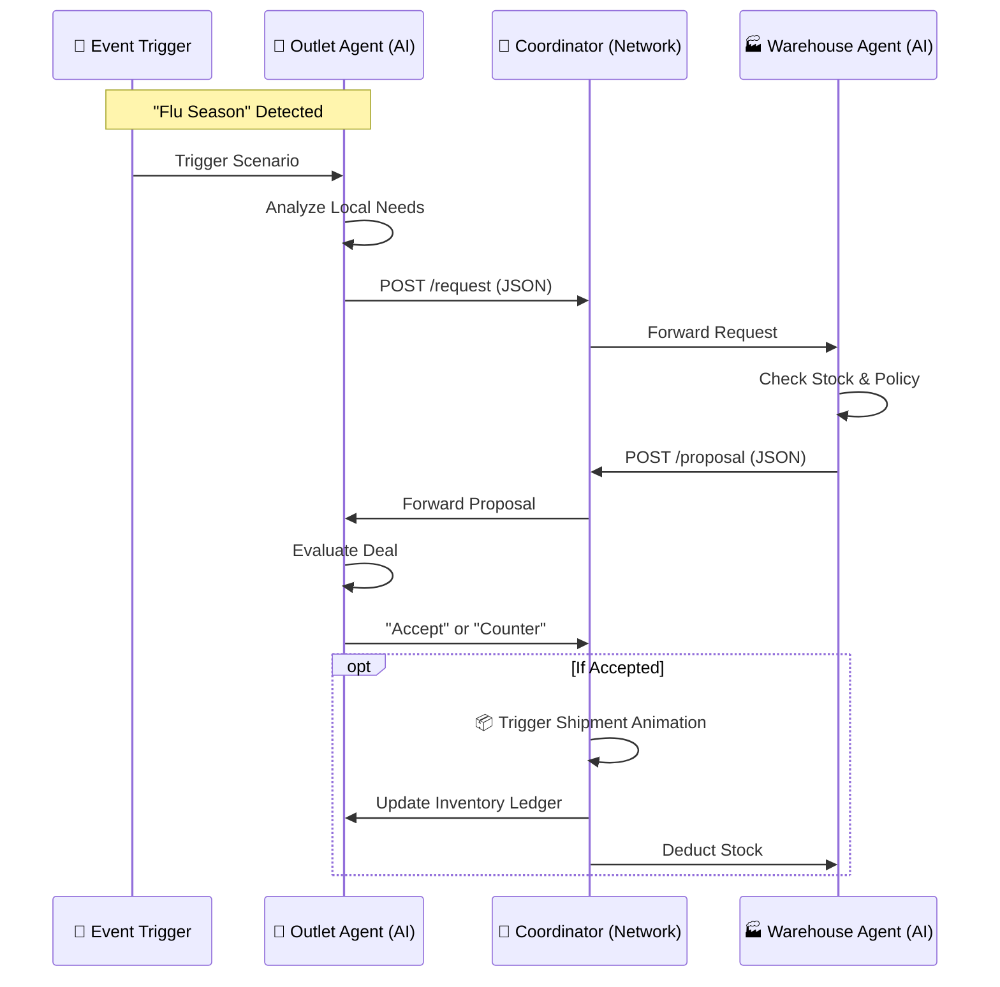

# Responsive AI Clusters in Pharma Supply Chain 💊



## Overview
This project demonstrates an **Autonomous Agent-to-Agent (A2A)** supply chain system where each facility (Warehouse, Hospital, Clinic) is represented by an independent AI Agent. These agents communicate using the **A2A JSON-RPC Protocol** to negotiate stock transfers, react to real-time events (like Flu Season or Recalls), and optimize inventory without central orchestration.

## Key Features
*   **Decentralized Intelligence**: Edge agents (Outlets) analyze local events autonomously using LLMs.
*   **A2A Negotiation**: Facilities negotiate agreements (Proposal/Counter-Proposal) rather than just updating a database.
*   **Real-time & Robust**: Handles hallucinations, manages inventory limits, and supports "Recall" (Reverse Logistics) workflows.
*   **Visual Dashboard**: React-based UI showing real-time agent reasoning (Analysis, Reasoning, Proposal) and physical shipments.

## Architecture & Flow

The system consists of a centralized Coordinator (acting as the network/OS) and multiple independent Agent Services.

### A2A Negotiation Flow


### System Components
*   **Coordinator (`:8080`)**: The "Supply Chain OS". Manages the simulation clock, routes A2A messages, enforces mutex locks on inventory, and broadcasts state to the Frontend.
*   **Warehouse (`:8081`)**: The Fulfillment Manager. Uses strict directives to validate requests and manage depot stock.
*   **Outlets (`:8082-8085`)**: Medical Facilities (Hospitals, Clinics). They possess "Local Intelligence" to interpret vague events like "Emergency Walk-ins" into specific inventory needs.
*   **Frontend (`:5173`)**: React + Tailwind dashboard visualizing the agent thought process and physical logistics.

## Setup & Running

### Prerequisites
*   **Go 1.21+**
*   **Node.js 18+**
*   **Ollama** running locally with `deepseek-r1:1.5b` model.

### Quick Start
1.  **Start Ollama**:
    ```bash
    ollama run deepseek-r1:1.5b
    ```
2.  **Run Simulation**:
    ```bash
    ./start_all.sh
    ```
3.  **Open Dashboard**:
    Visit `http://localhost:8080` (or the frontend port `http://localhost:5173`).

## Protocol Details
The agents speak **A2A (Agent-to-Agent)**, a JSON-RPC based semantic protocol.

**Sample Request (Outlet -> Warehouse):**
```json
{
  "analysis": "Flu season detected, high demand expected.",
  "request": {
    "Antibiotics": 100,
    "Vaccines": 50
  }
}
```

**Sample Proposal (Warehouse -> Outlet):**
```json
{
  "reasoning": "Stock is low, capping antibiotics to 50.",
  "proposal": {
    "Antibiotics": 50,
    "Vaccines": 50
  }
}
```

## Contributing
*   `backend/cmd/coordinator`: Core logic and Simulation Loop.
*   `backend/cmd/warehouse`: Warehouse Agent logic.
*   `backend/cmd/outlet`: Outlet Agent logic.
*   `frontend/src/components`: UI components.

---
*Built with ❤️ by the A2A Coding Agent.*
